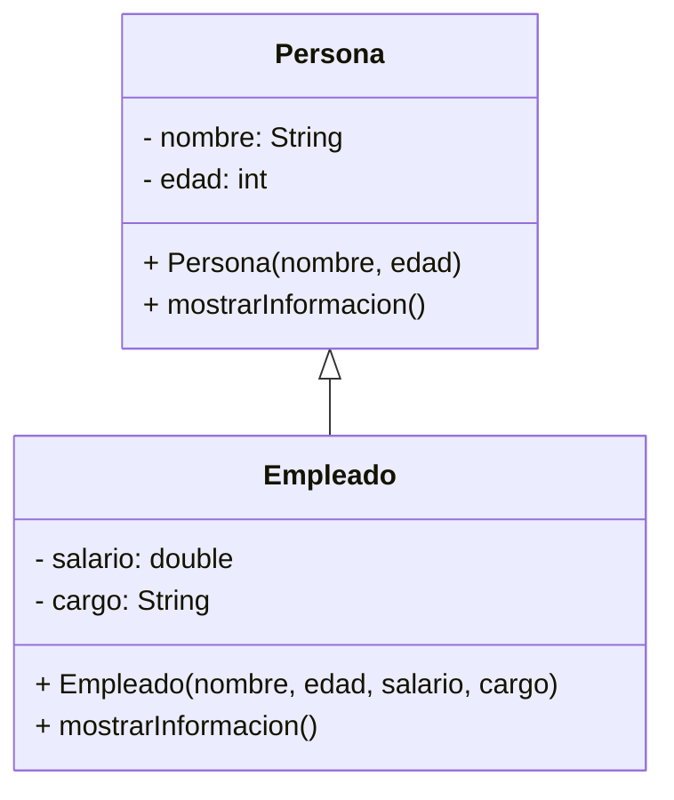

# OOP_quiz
Supongamos que estás creando un sistema para administrar los empleados de una empresa. Para simplificar, puedes modelar a los empleados como personas, con atributos como nombre, edad y salario.

1. Crea una clase `Persona` con los siguientes atributos:
   - `nombre` (String)
   - `edad` (int)

2. Crea una clase `Empleado` que herede de `Persona` y agregue el siguiente atributo:
   - `salario` (double)
   - `cargo` (String)

4. Define un constructor en la clase `Persona` que acepte el nombre y la edad como parámetros, y otro constructor en la clase `Empleado` que acepte el nombre, la edad, cargo y el salario como parámetros.

5. Define un método `mostrarInformacion()` en la clase `Persona` que imprima el nombre y la edad de la persona, y otro método `mostrarInformacion()` en la clase `Empleado` que imprima el nombre, la edad, cargo y el salario del empleado.

### Diagrama de Clases UML:

### Preguntas para responder:

```java
public void responderPreguntas() {
    // 1. ¿Cuál es la diferencia entre una clase `Persona` y una clase `Empleado` en términos de atributos y métodos?
    
    // 2. ¿Cómo se establece la relación de herencia entre `Empleado` y `Persona` en Java?
    
    // 3. ¿Qué es un constructor en Java y cuál es su propósito?
    
    // 4. ¿Por qué es útil utilizar la herencia en la programación orientada a objetos?
    
    // 5. ¿Cómo se llama el proceso de crear un objeto a partir de una clase en Java?
    
}

